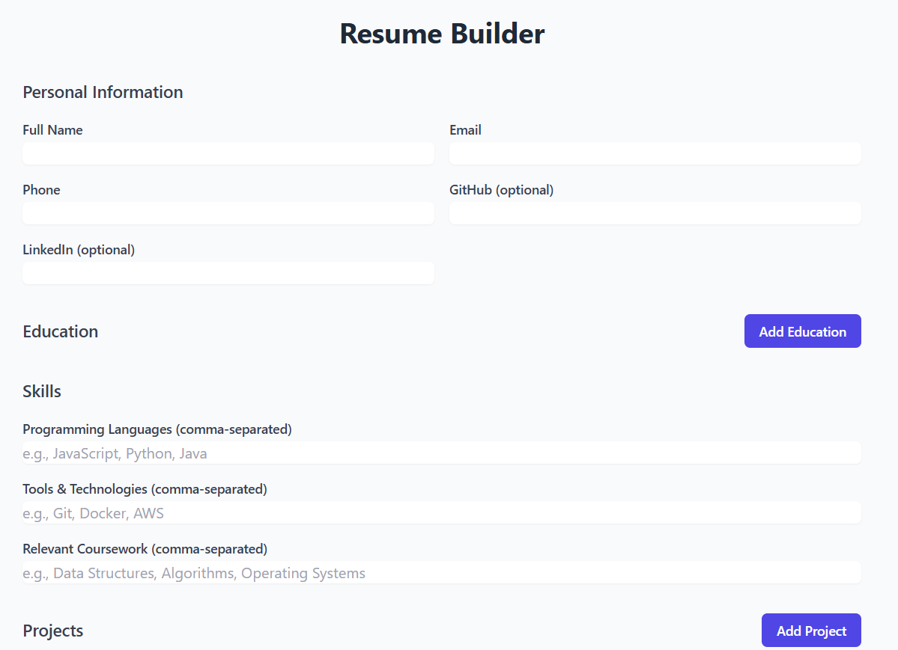

# ResumeGenerator 📄

ResumeGenerator is a web application that allows users to automatically generate and manage their resumes. Built with React and TypeScript, this project helps users create, preview, and manage their resumes through a simple and intuitive interface.

## Problem Statement
With the ResumeGenerator project, we aim to streamline the process of creating professional resumes by providing users with an easy-to-use platform where they can quickly build their resumes by filling out dynamic forms, see real-time previews, and download or share their completed resumes.

### Features
- **Dynamic Forms**: Add personal details, education, skills, projects, and awards.
- **Real-Time Preview**: View changes to the resume in real time as you make edits.
- **Modular Components**: Reusable components for forms and resume previews to make the development process efficient.
- **Responsive Design**: The application works seamlessly across devices.
  
### Built Using
[](https://reactjs.org/)
[](https://www.typescriptlang.org/)
[](https://tailwindcss.com/)
[](https://vitejs.dev/)
[](https://nodejs.org/)

### Project Screenshots



## Run the Project Locally

To run the ResumeGenerator application locally, follow the steps below:

1. **Clone the repository**:
    ```bash
    git clone https://github.com/Hitesh-PSG/ResumeGeneerator
    ```

2. **Navigate to the project directory**:
    ```bash
    cd your-repo-name
    ```

3. **Install dependencies**:
    ```bash
    npm install
    ```

4. **Run the development server**:
    ```bash
    npm run dev
    ```

5. **Open the application** in your browser at `http://localhost:5173`.

### Building for Production

To build the application for production:

1. **Build the project**:
    ```bash
    npm run build
    ```

2. **Serve the production build**:
    ```bash
    npm run preview
    ```
